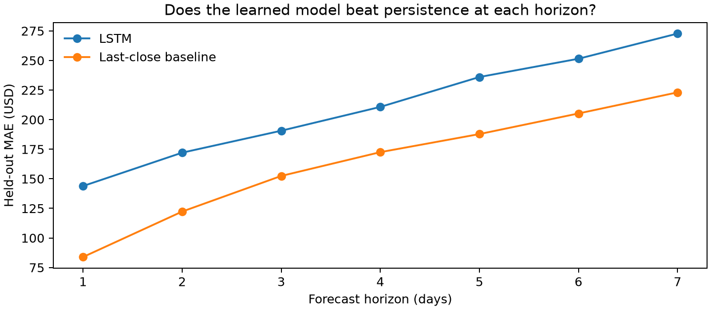

# Crypto Guardian — seven-day LSTM evaluation

[Executed notebook](notebooks/LSTM_ETH_Forecasting.ipynb) · [Horizon errors](runs/lstm/held_out_horizon_metrics.csv)

This is a **new follow-up experiment** for the AI Odyssey 2025 Crypto Guardian
hackathon project (3rd place). It does not reproduce an unavailable original
checkpoint or validate the missing rug-pull/pump-and-dump datasets.

## Question and result

Can 30 days of ETH OHLCV predict the next seven daily closes better than carrying
forward the latest observed close?

- Data: 2,922 cached daily ETH observations, 2018–2025, with URLs and SHA256 manifest.
- Train before 2023; validation 2023–2024; 359 test windows with targets entirely in 2025.
- Train-only MinMax scaling; specified two-layer LSTM; CUDA training; validation early stopping.
- Mean MAE: **$211.09 LSTM vs $163.89 persistence**. LSTM loses on all seven horizons.
- Saved model/scaler replay reproduces the recorded forecasts. This tests correctness of the replay, not usefulness of the model.



The test set has been inspected; future model selection needs a new untouched
confirmation period. Negative results and a disclosed worst window are retained.

## Reproduce

From the repository root on a compatible Linux CUDA machine:

```bash
uv venv --python 3.12.13 evaluation/.venv
uv pip install --python evaluation/.venv/bin/python \
  --extra-index-url https://download.pytorch.org/whl/cu130 \
  --index-strategy unsafe-best-match -r evaluation/requirements-gpu.lock.txt
evaluation/.venv/bin/python evaluation/verify_files.py
evaluation/.venv/bin/python evaluation/verify_lstm_artifacts.py
```

The second command replays the saved model, without training. To train anew:
`evaluation/.venv/bin/python evaluation/execute_notebooks.py LSTM_ETH_Forecasting.ipynb`.
A fresh run can differ; it must not be described as the recorded result.

The notebook contains the actual training code and executed outputs; scripts
handle execution and independent artifact verification. Keras uses its PyTorch
CUDA backend here. Original inputs/models/results are included; source/model
checksums are in `PUBLICATION-MANIFEST.json`. Data provider terms remain applicable.
